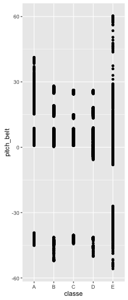
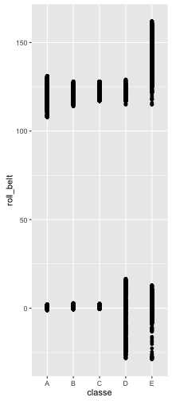
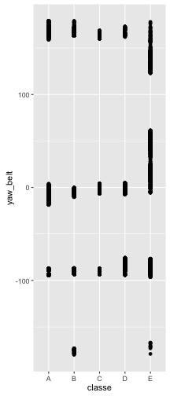

Practical Machine Learning : Determining Classe Column  
=====================================================================================

#### Author: Malay Das 


#### 1. Overview:
###### This Report will essentially determine the Classe column of the testing dataset provided. In order to achieve that i will be taking help of exploratory analysis and subsequent model assessment using Cross Validation Technique.


```r
## Setting environment variable for consistent random variable generation
set.seed(1);options(warn=-1)

## Library Inclusion 
suppressPackageStartupMessages(library(tidyr));suppressPackageStartupMessages(library(dplyr))
suppressPackageStartupMessages(library(ggplot2));suppressPackageStartupMessages(library(caret))
suppressPackageStartupMessages(library(tidyr));suppressPackageStartupMessages(library(parallel))
suppressPackageStartupMessages(library(plyr));suppressPackageStartupMessages(library(dplyr))
suppressPackageStartupMessages(library(splines));suppressPackageStartupMessages(library(survival))
suppressPackageStartupMessages(library(randomForest));suppressPackageStartupMessages(library(gbm))

## Setting up the processing directory 
landdir<-"/Users/malaydas/Documents/Data Science/Practical Machine Learning/Project Work/";setwd(landdir)

## Reading Data Files 
training=read.csv("pml-training.csv")
testing=read.csv("pml-testing.csv")
```

#### 2. Re-formatting the datasets:
###### The dataset provided as training set has multiple column with very sparse data in it. Most of the values in these columns are 'NA'. Although it's true that for missing values, we normally can think of imputing values.But here most of  the values are missing , hence this decision of removing those columns where most of the values are missing. 


```r
finaltrain=training[,c(grep("user_name",names(training)),grep("classe",names(training)),grep("timestamp",names(training)),grep("window",names(training)),grep("^total_accel",names(training)),grep("^gyros",names(training)),grep("^accel",names(training)),grep("^magnet",names(training)),c(grep("^roll",names(training)),grep("^pitch",names(training)),grep("^yaw",names(training))))]

finaltest=testing[,c(grep("user_name",names(testing)),grep("classe",names(testing)),grep("timestamp",names(testing)),grep("window",names(testing)),grep("^total_accel",names(testing)),grep("^gyros",names(testing)),grep("^accel",names(testing)),grep("^magnet",names(testing)),c(grep("^roll",names(testing)),grep("^pitch",names(testing)),grep("^yaw",names(testing))))]
```

#### 3. Exploratory Analysis:
##### 3.1 Exploratory charts:
###### Below mentioned plots ( classe vs pitch_belt , classe vs roll_belt and classe vs yaw_belt ) explains how classe variable is related to some of the possible predictors. 

   

##### 3.2 Conclusion out of Exploratory Analysis:
###### As i review plots,it is pretty much evident that there is no linear relationship between pitch_belt,yaw_belt and roll_belt with classe variable. Hence i can safely exclude linear model of consideration. 

#### 4. K Fold Cross Validation :
###### In next few paragraph , I will be using cross validation for model selection. I will be trying random forests and generalized boosting modeling technique; since these are two of the most accepted/correct model available. Once done with cross validation, i will select final model to apply the testing dataset. 

##### 4.1 Using Random Forest (Here k=3)
###### Accuracy using rf is

```r
train_control=trainControl(method="cv",number=3)
modelrf=train(classe~.,data=finaltrain,trControl=train_control,method="rf",verbose=FALSE)
pred=predict(modelrf,finaltrain[,-2])
confusionMatrix(finaltrain$classe,pred)$overall['Accuracy']
```

```
## Accuracy 
##        1
```
##### 4.2 Using Generalized Boosting (Here also k=3)
###### Accuracy using gbm is

```r
train_control=trainControl(method="cv",number=3)
modelgbm=train(classe~.,data=finaltrain,trControl=train_control,method="gbm",verbose=FALSE)
pred=predict(modelgbm,finaltrain[,-2])
confusionMatrix(finaltrain$classe,pred)$overall['Accuracy']
```

```
##  Accuracy 
## 0.9987769
```
##### 4.3 Model Selection
###### Looking at accuracy of either of "gbm" and "rf" ; i am reasonably convinced either of them will do very good if tested against out of sample dataset. Since i need to choose only one, i am going for the "gbm",as for this dataset "gbm" executing much faster with 99% accuracy. I am trading off model execution speed with accuracy by not picking 100% accurate model i.e Random Forest. 


#### 5. Expected out of sample error :
###### Since i have choosen "Generalized boosting" over "Random Forests"; my out of sample error is around 1% 

#### 6. Applying Cross Validated Model on Test Set :

```r
predtest=predict(modelgbm,finaltest)
predtest
```

```
##  [1] B A B A A E D B A A B C B A E E A B B B
## Levels: A B C D E
```

#### 7. Conclusion :
###### Incidentally, after applying the model on testing dataset , I found the result is 100% correct ( based on the quiz). Now I have lot of confidence on this model.


